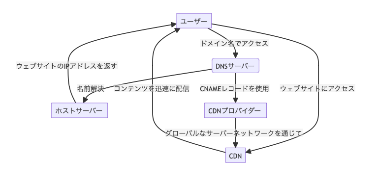

な ブラウザから DB に辿り着くまで

## 参考

---

https://zenn.dev/moko_poi/articles/c2402f13a870a1

## 目次

- [ブラウザから DB に辿り着くまで](#ブラウザから-db-に辿り着くまで)
  - [参考](#参考)
  - [目次](#目次)
  - [名前解決](#名前解決)
    - [DNS の役割](#dns-の役割)
    - [名前解決し、サイトにアクセスするまでのフロー](#名前解決しサイトにアクセスするまでのフロー)
      - [1. ローカル DNS キャッシュのチェック](#1-ローカル-dns-キャッシュのチェック)
      - [2. ISP の DNS サーバ](#2-isp-の-dns-サーバ)
      - [3. ルート DNS サーバへのクエリ](#3-ルート-dns-サーバへのクエリ)
      - [4. TLD サーバー](#4-tld-サーバー)
      - [5. オーソリティ DNS サーバー](#5-オーソリティ-dns-サーバー)
    - [CDN の最適化](#cdn-の最適化)
    - [CDN の仕組み](#cdn-の仕組み)
      - [1. コンテンツのキャッシュ](#1-コンテンツのキャッシュ)
      - [2. 地理的近さ](#2-地理的近さ)
      - [3. 負荷分散](#3-負荷分散)
      - [4. コンテンツの最適化](#4-コンテンツの最適化)
      - [5. セキュリティの向上](#5-セキュリティの向上)
  - [通信](#通信)
    - [1. TLS ハンドシェイク](#1-tls-ハンドシェイク)
    - [2. TLS 証明書の検証](#2-tls-証明書の検証)
  - [セキュリティ](#セキュリティ)
  - [負荷分散](#負荷分散)
  - [アプリケーションサーバ・API サーバ](#アプリケーションサーバapi-サーバ)
  - [インメモリデータベース](#インメモリデータベース)
  - [データベース](#データベース)

## 名前解決

ここでは名前解決、および DNS、CDN の役割について。
最初のステップは、人間が理解できる URL に含まれる「**ドメイン名**」をコンピュータやネットワーク機器が扱う「**IP アドレス**」へと「**解決する**」こと。

### DNS の役割

DNS サーバは Web サイトのドメイン名を IP アドレスに変換する
この変換プロセスを通じて、ブラウザは Web サイトのホストサーバに接続するための正確なアドレスを知ることができる。

また、DNS レコードのキャッシングによってこの名前解決(ドメイン名 →IP アドレス)のプロセスは高速化される
→ 再度同じ Web サイトにアクセスした際の遅延が減少

### 名前解決し、サイトにアクセスするまでのフロー

**【ケース】**
ブラウザに「example.com」と入力した場合

1. ローカル DNS キャッシュのチェック
2. ISP の DNS サーバ
3. ルート DNS サーバーへのクエリ
4. TLD サーバー
5. オーソリティ DNS サーバー

#### 1. ローカル DNS キャッシュのチェック

ブラウザに「example.com」を入力して Enter キーを押されると、ブラウザはまずローカルマシンの DNS キャッシュをチェックする
→ ローカルの DNS キャッシュに example.com の IP アドレスが存在しているかチェック

#### 2. ISP の DNS サーバ

DNS キャッシュに該当のアドレスが見つからなかった場合、クエリはインターネットプロバイダ（ISP）の DNS サーバに転送されます
ISP の DNS サーバもそのクエリの答えを持っていない場合、次のステップへと進みます

もし ISP の DNS サーバーが既にそのドメイン名の IP アドレスをキャッシュしている場合、それを直接クライアントに返し、これによりウェブサイトにすぐにアクセスすることが可能

→ISP の DNS サーバってのがいわゆるフルリゾルバっぽいかも
https://jprs.jp/glossary/index.php?ID=0158

#### 3. ルート DNS サーバへのクエリ

ISP の DNS サーバーでクエリに該当するアドレスが見当たらなかったら、ISP の DNS サーバーからルートの DNS サーバへクエリが送られる

ルートの DNS サーバーはドメインネームシステムの（DNS）の最上位に位置し、**トップレベルドメイン(TLD)** への参照情報を提供する

ルート DNS サーバーは直接リダイレクトするのではなく、適切な **TLD(トップレベルドメイン)の サーバーへの参照リストを返す**ことで応答します。

#### 4. TLD サーバー

ルート DNS サーバーからの応答情報を基に、ISP の DNS サーバーは「**.com**」などの TLD サーバーにクエリを送る
TLD(トップレベルドメイン) サーバーはそのドメイン名（この場合は「example.com」）のネームサーバー情報を持っている

TLD サーバはドメイン名(example.com)に関するオーソリティ DNS サーバ（権威 DNS サーバ = **ネームサーバ**）のアドレスを提供する

[引用: https://jprs.jp/glossary/index.php?ID=0158](https://jprs.jp/glossary/index.php?ID=0158)

#### 5. オーソリティ DNS サーバー

ここまでで、クエリが example.com というドメイン名のオーソリティ DNS サーバに到達する
オーソリティ DNS サーバでは、完成した Web サイトの IP アドレスの名前解決が完了し、IP を返す

### CDN の最適化

DNS の名前解決が完了すると、CDN を通じてコンテンツの配信が行われる
（例えば、CNAME レコード(エイリアス)を使用して CDN プロバイダーを指す場合）

グローバルに分散したサーバーネットワークを利用して、ユーザーにより近い場所からウェブコンテンツを迅速に配信
CDN は、特に大きなファイルやメディアコンテンツを扱うサイトでその効果を発揮し、レスポンス時間の短縮、サーバーの負荷軽減する

なんとなくだが、DNS の名前解決では CDN のエッジサーバの IP アドレスを返し、ブラウザは CDN のエッジサーバーの IP アドレスを使ってコンテンツをリクエストする
CDN のエッジサーバーは、オリジンサーバーからコンテンツを取得し、ユーザーに配信する

↑↑ こんな流れな気がする

### CDN の仕組み

1. コンテンツのキャッシュ
2. 地理的近さ
3. 負荷分散
4. コンテンツの最適化
5. セキュリティの向上

#### 1. コンテンツのキャッシュ

CDN のエッジサーバーは、オリジンサーバーからコンテンツ（HTML ページ、画像、動画、スタイルシート、JavaScript ファイルなど）をコピーし、キャッシュ（一時的に保存）します

#### 2. 地理的近さ

ユーザーがウェブサイトにアクセスすると、**DNS 解決プロセス**により、ユーザーに最も近い CDN のエッジサーバーが選択されます。
これにより、データが長距離を移動する時間が短縮され、ウェブページのロード時間が改善されます。

#### 3. 負荷分散

CDN は、コンテンツのリクエストを**複数のエッジサーバーに分散させる**ことで、特定のサーバーにかかる負荷を均等に分けます。
これにより、高トラフィック時でもコンテンツの高速配信を維持し、サーバーの過負荷を防ぎます。

#### 4. コンテンツの最適化

一部の CDN は、配信するコンテンツを**自動的に最適化する**機能を提供します。例えば、ユーザーのデバイスやブラウザに応じて画像サイズを調整したり、動画のビットレートを最適化したりします。

#### 5. セキュリティの向上

CDN は、DDoS 攻撃などのサイバー脅威からウェブサイトを保護する役割も担います。分散したエッジサーバーを利用してトラフィックをフィルタリングし、攻撃を緩和することができます。

## 通信

ブラウザ(ユーザー)が CDN エッジサーバまたは最終的なウェブサーバに接続すると **TLS ハンドシェイク**が行われる

ユーザーが Web ブラウザを使用して EC サイトにアクセスする際には基本的に、**HTTP/HTTPS プロトコルを通じて安全なデータ交換**が行われる

HTTPS は **TLS(Transport Layer Security)を利用して通信を暗号化**し **TLS 証明書**によってサーバーの身元を証明する

これにより、ユーザーとウェブサイト間の通信が保護され、信頼できる安全な接続が確立されます。
HTTPS 通信の暗号化と TLS 証明書による正当性の確認は、以下のステップで行われます

1. TLS ハンドシェイク
2. TLS 証明書の検証
3. 暗号化キーの交換
4. 通信の暗号化
5. 通信の終了

#### 1. TLS ハンドシェイク

1. **クライアントハロー**
   - ブラウザがサーバに接続し、使用可能な暗号化方式や TLS のバージョン情報などを送信する
2. **サーバーハロー**
   - サーバーはクライアントに応答し共通の暗号化方式や TLS のバージョンを選択し、自身の TLS 証明書をクライアントに送信する
   - 実際に証明書を利用するのはクライアントとの直接的なやり取りを担うロードバランサーの場合が多い

#### 2. TLS 証明書の検証
ブラウザはサーバーから受け取ったTLS証明書の検証を行う

【検証事項】
- 信頼できる認証局に発行されたものか
- 有効期限内であること
- サイトのドメイン名と一致してること

#### 4. 暗号化キーの交換
サーバーとクライアントはセッション中に使用する暗号化キーを安全に交換する

これにより、以後セッション有効中はキーによる通信の暗号化が行われる

このキーの交換には**公開鍵暗号化方式**が用いられる

#### 5. 通信の暗号化
キーの交換が完了すると、サーバーとクライアントの通信はすべて暗号化される

#### 6. 通信の終了
通信のセッションが終了すると、使用した暗号化キーが破棄される

次回の通信時には、再度キーの交換および安全な通信のセッションが開始される

#### 補足

TLSセッションとHTTPセッション

→ 結論、セッションすなわち接続のレイヤが異なる。

## セキュリティ

Webサイトへのアクセスは、基本的に複数のセキュリティ層を通過することで保護される

代表的なものとして、

- ファイヤウォール
- Webアプリケーションファイヤウォール
- DDoS攻撃防御

### ファイヤウォール
ファイヤウォールでは、**不正なトラフィックがネットワークに侵入するのを防ぐ**

これにより**ウェブサーバが悪意のあるアクセスから保護され、ユーザのデータが安全**に保たれる

### Webアプリケーションファイヤウォール（WAF）
ウェブアプリケーションを標的とする**SQLインジェクション**や**クロスサイトスクリプティング**などの攻撃から保護するためのもの

WAFではウェブアプリケーションへのリクエストを監視することで悪意のある試みをブロックする

### DDoS攻撃防御
DDoS攻撃（分散型サービス拒否）は、サーバーを過負荷状態に陥らせ、正当なユーザーのアクセスを妨げるという攻撃

DDoS攻撃防御では、異常なトラフィックの増加を検出し、攻撃トラフィックをフィルタリングすることでサイトを維持する

### WAFについて

#### - 配置 -
WAFは基本的（例外はある）に、下記の配置をされることが多い

- CDNを介した静的コンテンツへのリクエストをフィルタリング
- 直接、ALB(アプリケーションロードバランサ)に向けられたAPIリクエストをフィルタリング

#### - 使い方 -
WAFは主には、入ってくるトラフィックをリアルタイムで監視し、ウェブアプリケーションに対する潜在的な攻撃を検知して、ブロックする

WAFはHTT/HTTPSトラフィックを解析し、アプリケーション層（第七層）での攻撃検知を行う

#### - ポリシー設定 -
##### SQLインジェクション防御ポリシー
ユーザーの入力フィールドでは特定のSQLキーワード(例: SELECT, INSERT, DELETE)や特殊文字(例: シングルクォート)の使用を禁止する

このポリシーにより、フォーム入力やURLパラメータを介した不正なSQLコマンドの実行を防ぐ

##### クロスサイトスクリプティング防御ポリシー
ユーザーからの入力やクエリパラメータに含まれるHTMLタグやJavaScriptのコードは表示前にサニタイズ（無効化）する

これにより、悪意のあるスクリプトの実行を防ぐ

#### - トラフィック分析 -
**異常なリクエストパターンの検出**:
短時間に多数のリクエストが同一IPアドレスから送られる場合、WAFはこれを自動的に検出し、攻撃の可能性があると判別する

## 負荷分散
### ロードバランサーの基本
ロードバランサーは入ってくるトラフィックを複数のサーバ間（アプリケーションサーバー）で分散させるデバイスまたはソフトウェア

このプロセスにより、単一サーバへの負荷が軽減され、全体の処理能力の向上およびレスポンスタイムの改善が期待できる

#### - 種類 -
- アプリケーションロードバランサー(ALB)
  - アプリケーション層で動作する
  - HTTP/HTTPSトラフィックの負荷分散を行う
  - リクエストの内容（使用されるURLやヘッダ情報）に基づいてルーティングを決定する
- ネットワークロードバランサー(NLB)
  - 第四層（多分トランスポート層）で動作する
  - IPプロトコルデータをもとにトラフィックの分散を行う

#### - 負荷分散戦略 -
- ラウンドロビン
  - サーバー群に順番にリクエストを割り当てるシンプルな戦略です。サーバーの処理能力が均等である場合に適して
- 最少接続数
- IPハッシュ

#### - 高可用性と冗長性 -
ロードバランサーを利用する主な目的の一つは、高可用性を確保することです

サーバーの一部がダウンした場合でも、ロードバランサーはトラフィックを健全なサーバーに自動的にリダイレクトすることで、サービスの中断を最小限に抑えます。

このため、ロードバランサー自体も冗長構成を取ることが一般的です。

#### - セッション接続性 -
#### - ヘルスチェック -

## アプリケーションサーバ・API サーバ

## インメモリデータベース

## データベース
